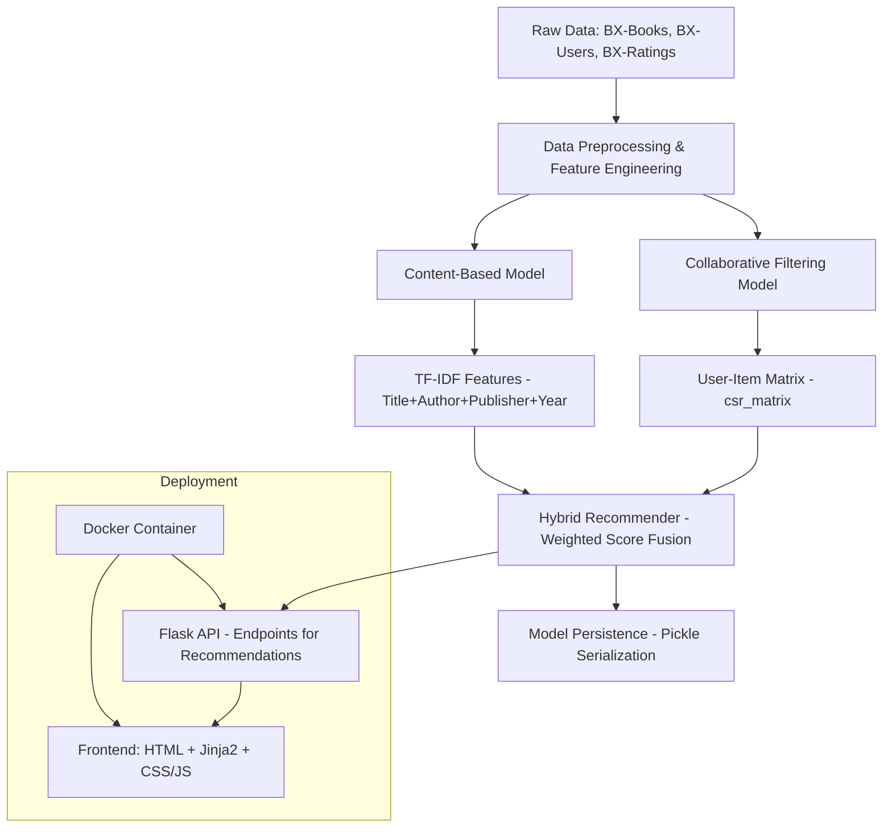

# **BookSage AI: hybrid book recommendation system**

BookSage AI is a **hybrid book recommendation system** combining **Collaborative Filtering (KNN-based)** and **Content-Based (TF-IDF + Cosine Similarity)** models, with a weighted hybrid approach for personalized results. The project ingests and preprocesses large-scale book datasets, applies active-user and popular-book filtering, and dynamically generates recommendations enriched with metadata (title, author, publisher, year, and cover image). I engineered a **modular architecture** with clear data pipelines, model persistence, and reusable functions, ensuring scalability and maintainability. The system was deployed as a **Dockerized Flask web application** with a responsive HTML/CSS front-end, integrated into a **CI/CD pipeline** for automated builds and deployments. This design demonstrates proficiency in **ML model building, orchestration, backend API development, front-end integration, containerization, and production-grade deployment workflows**.

[](https://github.com/user-attachments/assets/67c963f6-5edf-4e4c-8bc5-030a4a4219e4)

---

## **Live Demo**

**Try the Hybrid Book Recommendation System live:** [https://booksage-ai.onrender.com/](https://booksage-ai.onrender.com/)

---

## **Core Technologies**

| **Category**                | **Technology / Resource**                                                                 |
| --------------------------- | ----------------------------------------------------------------------------------------- |
| **Core Language**           | Python 3.11                                                                               |
| **Backend Framework**       | Flask (REST API for recommendations)                                                      |
| **Data Processing**         | Pandas (Data Cleaning & Merging), NumPy (Matrix Ops)                                      |
| **Recommendation Models**   | **Hybrid System**: Collaborative Filtering + Content-Based Filtering                      |
| **Collaborative Filtering** | SciPy (`csr_matrix`), scikit-learn (`NearestNeighbors`)                                   |
| **Content-Based Filtering** | scikit-learn (`TfidfVectorizer`, `cosine_similarity`)                                     |
| **Hybrid Fusion Logic**     | Weighted average score combination                                                        |
| **Data Sources**            | Book-Crossing Dataset (`BX-Books`, `BX-Users`, `BX-Ratings`)                              |
| **Feature Engineering**     | TF-IDF on combined features (`title`, `author`, `publisher`, `year`)                      |
| **Model Persistence**       | Pickle (Model & Processed Data Serialization)                                             |
| **Memory System**           | In-memory caching of processed data for faster responses                                  |
| **Evaluation Metrics**      | Popularity-based filtering, Active user filtering                                         |
| **Orchestration Layer**     | Modular service classes (`DataLoader`, `DataPreprocessor`, `ModelManager`, `HybridModel`) |
| **Frontend**                | HTML5, Jinja2 Templates, Static CSS & JavaScript                                          |
| **Deployment**              | Docker (Python 3.11-slim base), `requirements.txt` dependency locking                     |
| **Portability**             | Pathlib-based cross-platform directory resolution                                         |
| **Error Handling**          | Graceful fallbacks & empty results handling                                               |

---

## **Comparison with Standard Systems**

| Feature | BookSage AI | Typical Recommenders |
|---------|------------|----------------------|
| Method Flexibility | 3 modes + hybrid tuning | Usually single-method |
| Cold Start Handling | Popular books fallback | Often fails |
| Explainability | Shows scores + metadata | Black-box results |
| UI Customization | Adjustable weights/counts | Fixed parameters |

---

## **Project Structure**

```bash
BookSage-AI/
│
├── .github/
│   └── workflows/
│       └── main.yml
│
├── data/
│   ├── BX-Book-Ratings.csv
│   ├── BX-Books.csv
│   └── BX-Users.csv
│
├── main/
│   ├── __init__.py
│   ├── collaborative_model.py
│   ├── content_model.py
│   ├── config.py
│   ├── data_loader.py
│   ├── data_preprocessor.py
│   ├── hybrid_model.py
│   ├── main.py
│   ├── model_manager.py
│   └── recommendation_engine.py
│
├── models/
│   ├── book_pivot.pkl
│   ├── books_content.pkl
│   ├── books_data.pkl
│   ├── cb_model.pkl
│   ├── cf_model.pkl
│   ├── content_sim_matrix.pkl
│   ├── final_rating.pkl
│   ├── tfidf_vectorizer.pkl
│   └── title_to_idx.pkl
│
├── notebooks/
│   └── experiment.ipynb
│
├── static/
│   ├── css/
│   │   ├── style_recommender.css
│   │   └── style.css
│   └── js/
│       └── script.js
│
├── templates/
│   ├── index.html
│   └── recommendations.html
│
├── tests/
│   └── test_app.py
│
├── .gitignore
├── app.png
├── app.py
├── demo.mp4
├── Dockerfile
├── LICENSE
├── README.md
├── render.yml
├── requirements.txt
└── setup.py
```

---

## **Architecture Diagram (Mermaid)**


---

## **How to Setup (Locally)**

```bash
# Clone the Repository
git clone https://github.com/Md-Emon-Hasan/BookSage-AI.git
cd hybrid-book-recommender

# Setup Virtual Environment
python -m venv venv
source venv/bin/activate

# Install Dependencies
pip install -r requirements.txt

# Run Flask App
python app.py
```

---

## **How to Setup (Dockerized)**

```bash
# Clone the Repository
git clone https://github.com/Md-Emon-Hasan/BookSage-AI.git
cd BookSage-AI

# Build Docker Image
docker build -t booksage-ai .

# Run Docker Container
docker run -p 8501:8501 booksage-ai
```

---
  
